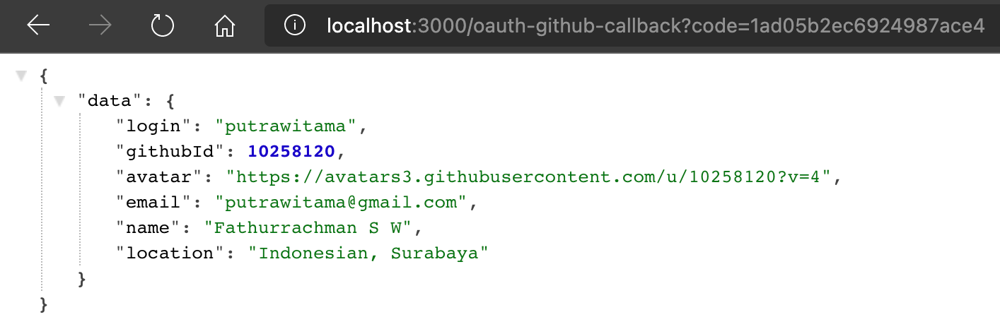

# CodeDebugging

Code debugging built with NodeJs

## Analisis

1. Ubah file env jadi .env
2. isi semua field pada env
3. pada index.js pindah syntax menjadi line 2
```
const envFound = dotenv.config();

if (envFound.error) {
  throw new Error("⚠️  Couldn't find .env file  ⚠️");
}
```

4. pada index.js ubah
```
module.exports = { config };
```
menjadi
```
module.exports = config;
```

5. pada authService.js terdapat kesalahan penulisan seharusnya `module.exports`

6. pada authCallbackService.js terdapat kesajalah penulisan resp yang seharusnya res dan data response dari github bukan berupa array accessToken, maka getnya juga seharusnya `res.data.access_token`

7. masih di file yang sama pada line 15 seharusnya arrow functionnya berupa asnyc agar ketika line 16 memanggil fungsi UserServices.getUserInfo dapat menunggu secara block sehingga variable user dapat terisi dengan response get user info dan dapat di response dengan baik.

8. pada userInfoService.js function getUserInfo sebaiknya berupa async karena akan mengembalikan data yang diperlukan. 

9. menambahkan return dan await pada line 5 sebelum axios untuk mengembalikan data.

10. pada param axios yaitu url seharusnya `${config.apiUrl}/user` untuk mendapatkan hanya data user yang login saja. bukan semua user

11. pada line 9 seharusnya access_token menggunakan bearer bukan token. karena itu sudah ketentuan oauth

12. menambahkan catch pada line 14 untuk mengantisipasi pada saat request terjadi error sehingga rapih.

13. pada module.export menjadi seperti berikut
```
module.exports = {
    getUserInfo: getUserInfo,
};
```
